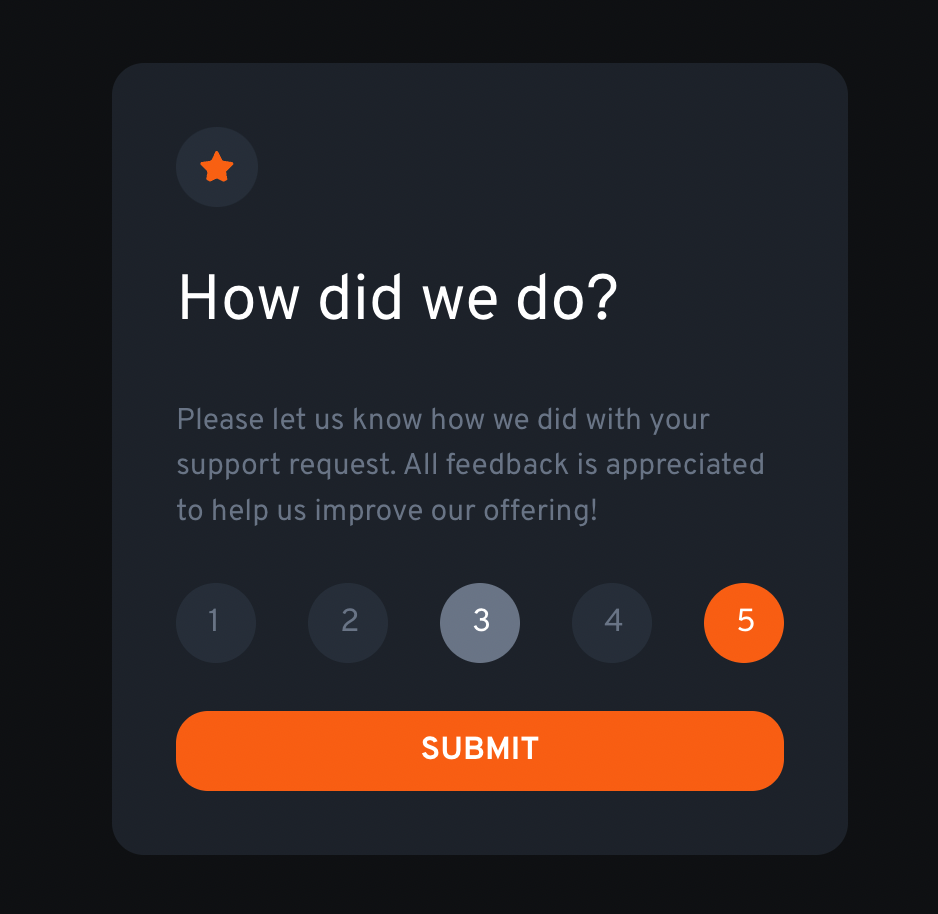

# Frontend Mentor - Interactive rating component solution

This is a solution to the [Interactive rating component challenge on Frontend Mentor](https://www.frontendmentor.io/challenges/interactive-rating-component-koxpeBUmI). Frontend Mentor challenges help you improve your coding skills by building realistic projects. 

## Table of contents

- [Overview](#overview)
  - [The challenge](#the-challenge)
  - [Screenshot](#screenshot)
  - [Links](#links)
- [My process](#my-process)
  - [Built with](#built-with)
  - [Useful resources](#useful-resources)
- [Author](#author)

## Overview

### The challenge

Users should be able to:

- View the optimal layout for the app depending on their device's screen size
- See hover states for all interactive elements on the page
- Select and submit a number rating
- See the "Thank you" card state after submitting a rating

### Screenshot

### Links

- Solution URL [Link](https://github.com/ssalopek/frontendmentor-interactive-rating)
- Live Site URL [Link](https://ssalopek.github.io/frontendmentor-interactive-rating/)

## My process

### Built with

- Semantic HTML5 markup
- LESS & LESS custom properties
- Flexbox
- JavaScript

### Useful resources

- [GeekForGeeks](https://www.geeksforgeeks.org/how-to-get-value-of-selected-radio-button-using-javascript/) - This basically helped me to better understand how to detect checked radio button and it's value. If your approach to this challenge is with radio buttons this article will help you the best in my opinion.

## Author

- Frontend Mentor - [@ssalopek](https://www.frontendmentor.io/profile/ssalopek)